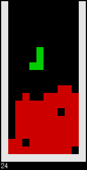

# vmTetris

Tetris in a small virtual machine.
Use the cursor keys.
Press `esc` to quit.

```c
m[444],c,x;main(o,a){for(system("stty cbreak -echo min 0"),srand(a);o=f();o<42?a
=(x=o/2%7)<3?x:x<4?f():x<5?m[f()<23?x:m[x-23]]:x<6?read(0,m,1):rand()%f(),m[x=o%
2?f():m[6]++]*=o<28,a=m[x]+=o>13?a:-a:o<45?putchar(o%3?o%2*75+f():a):o<63?f(),c=
!a^o/54?x+o%9*75:c:usleep(20000));system("stty sane");}f(){return x=c++["NCRM7@\
BD;527e4R37Q<Q9M27e@Q:OQ9MQ9Q;MQ9OMQ;Q9B7MQEQ:Q:OM27e^MQEMQ:OQ8KMQEOQ8OMQDMKQ:O\
MMQDQ:OQ:P7KMQ;OQ:Q927fDP7MMQ8MQ;Q:27fSRE5RE<Q6D952<ffR;<Q62<fr[JZ?[a[y`KT=>T?@\
LD2C^_L/V<gE6J/c@6U/g[68?^[D;?2/ggD:=NDTBC2/gm@=2/gs2=P8RE5RF<R;;TL747h?47K25T=\
9D;9859_iTA:F?:T=9R26FQ9859_iF59@:26hV`<B7`8RI98=9c@>D`0N8T@?T>=guS825=2;h3252<\
h028k7RI=X66DM6R:9T6AF6A29iZX2?T?9F9?F9?RE5RE<TL7=27c@2<isR[5RD<=R9;R97N98L9jJ2\
7=2;jA>7k3T5;N558aX25C9T;5>0ji2BT5;T576:7SN456F7jlT;52<j:[JZ?[j[wR[5RD<R;;[JZ?[\
cTL7D_7YZQ[O[O=2;kH25[92<kE[JZ?ZQR45TL9l025kq=TL9D_9Y25l0[9n^7/"]-47;}/********/
```



Snake in the same virtual machine.

```c
m[444],c,x;main(o,a){for(system("stty cbreak -echo min 0"),srand(a);o=f();o<42?a
=(x=o/2%7)<3?x:x<4?f():x<5?m[f()<23?x:m[x-23]]:x<6?read(0,m,1):rand()%f(),m[x=o%
2?f():m[6]++]*=o<28,a=m[x]+=o>13?a:-a:o<45?putchar(o%3?o%2*75+f():a):o<63?f(),c=
!a^o/54?x+o%9*75:c:usleep(20000));system("stty sane");}f(){return x=c++["RC5RQ6\
326e5R@6T5>3DP5>7eP26e=@7e2RP6D9;26eSR3=N<[JZ?[a[yfcL/V:ek6J/a56U/f3L<6Q<2/f:RQ\
<2/f@N<2/fHL<2<F<;TR5^?D35j5@==58]X25C9T95RW5Jy5Jy5Jy5Jy5Jy5Jy5Jy5Jy5TL6fc63:S:\
N9T;5S=>9^M251grRC5TL6^fTL7B7^fB7^f46^f@6S68>5^rF>5gP[JZ?[j[wRC5RA:RQ9TL6DQ58L6\
_O26_OB6_OZChQ[O6Q5T57TL6=8L6_l26_lB6_lZ`iCP8TL6DQ58L6`A26`AB6`A6R528hnZC`C[OT7\
5=29h8[92:h5Z7ZGZSZVZI[i[OR35TL7il25ib=TL7D_7Y25il[9nnnnn\\i/"]-47;}/**********/
```


